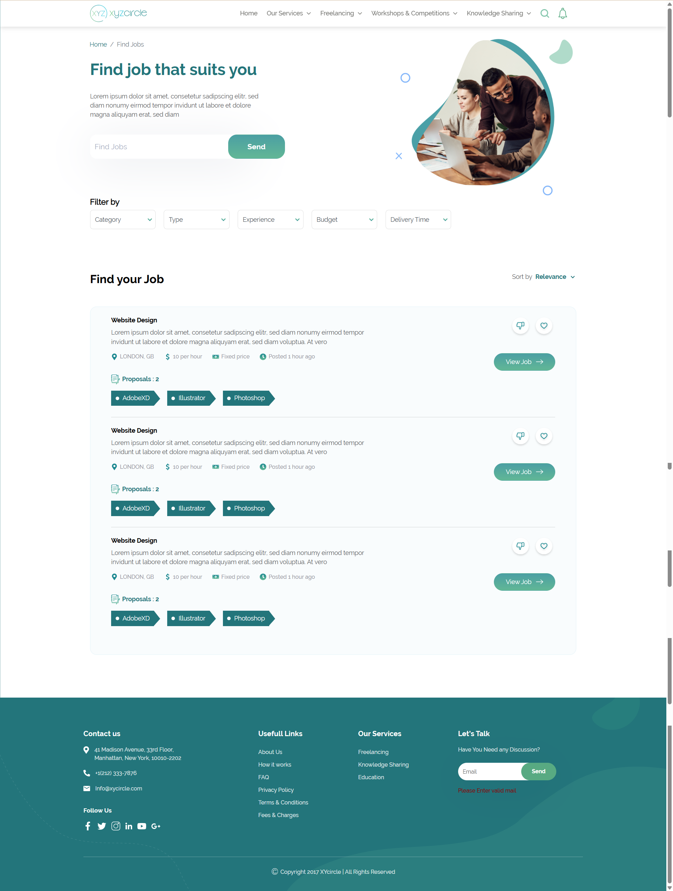
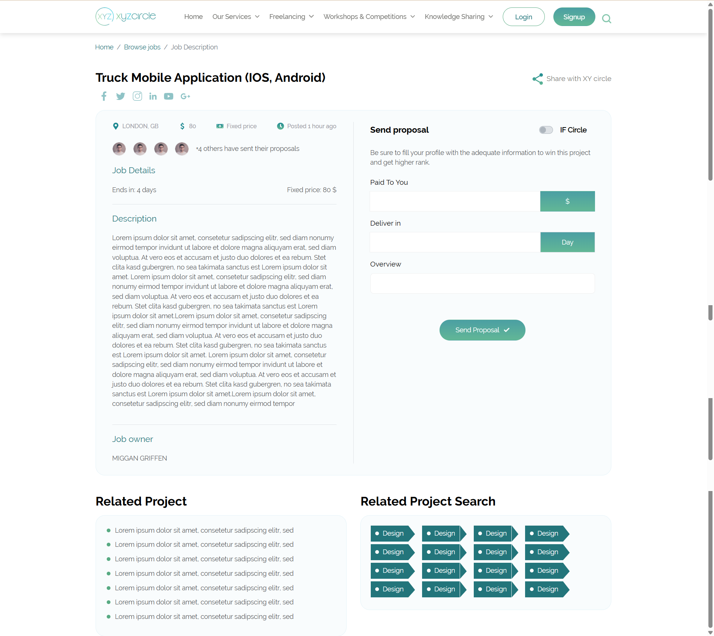
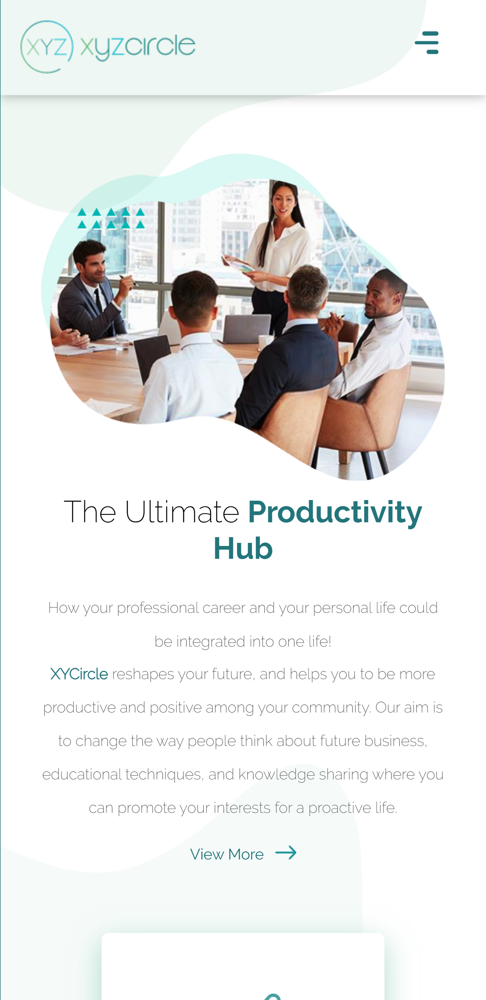

# Project Name

XYZcircle focuses on three main axes: freelancing, education, and knowledge sharing. So, we intend to change the world's vision towards how to be more productive and pro-active in freelancers’ lives.

---

## 🔗 Demo

- Live Demo: https://xycircle.vercel.app/

---

## 👩‍💻 My Role (Frontend Developer)

I was responsible for implementing and maintaining the frontend layer of the application.  
My main tasks included:

- Building UI pages using **HTML5 and CSS3**
- Creating **fully responsive layouts** for desktop, tablet, and mobile
- Implementing **animations and UI interactions**
- Collaborating with backend developers to integrate frontend code
- Fixing UI issues after backend integration
- Handling layout breaks and visual bugs caused by data or logic changes

---

## 🛠 Tech Stack

### Frontend

- HTML5
- CSS3
- Responsive Design (Flexbox / Grid / Bootstrap)
- CSS Animations & Transitions
- JavaScript (basic DOM handling if applicable)

### Backend

- ASP.NET (.NET)

### Tools

- Git & GitHub
- Browser DevTools
- VS Code / Visual Studio

---

## ⚙️ Build & Automation

This project uses **Gulp** to automate frontend tasks such as:

- Compiling and organizing CSS files
- Watching files for changes
- Optimizing assets
- Improving development workflow

---

## 📸 Screenshots

  
   
  
       
  
     
  

---

## 🔄 Workflow

1. Receive page requirements or designs
2. Build static HTML & CSS layouts
3. Add responsiveness and animations
4. Hand off code to backend developer
5. Fix UI issues after integration
6. Refine UI based on real data and feedback

---

## 🚧 Challenges & Solutions

- **Challenge:** UI breaking after backend integration  
  **Solution:** Refactored CSS structure and improved layout flexibility

- **Challenge:** Different screen sizes and resolutions  
  **Solution:** Implemented responsive layouts using Flexbox/Grid

---

## 📈 What I Learned

- Working within a backend-driven (.NET) environment
- Handling real production UI issues
- Improving UI resilience during continuous development
- Better collaboration with backend developers

---

## 🔒 Notes

This project was developed for internal/client use.  
Source code and live demo are not publicly available.

---

## 👩‍💻 Author

Shimaa Mohamed
Frontend Developer  
Portfolio: https://shimaamohamed.vercel.app/
GitHub: https://github.com/shimaamohamed923

## 📄 License

This project is licensed under the MIT License.
